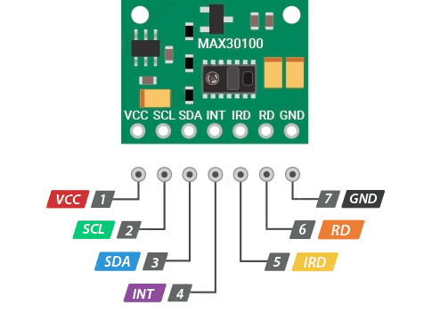
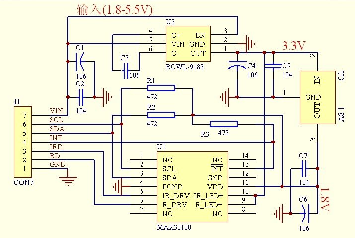

# MAX30100

This repository contains the solution for Pulse Oximeter and Heart-Rate Sensor IC MAX30100. It can be used to measure: 

- Heartbeat (beats per minute)
- [SpO2](https://en.wikipedia.org/wiki/Oxygen_saturation) (peripheral oxygen saturation, %)

## Connection

|Group        |Name|Description                                 |
|-------------|----|--------------------------------------------|
|Power        |VCC |1.8 - 5.5 V                                 |
|Data exchange|SCL |I2C Clock Input                  |
|Data exchange|SDA |I2C Clock Data (Open-Drain)      |
|Data exchange|INT |Active-Low Interrupt (Open-Drain)           |
|LED power    |IRD |Power Supply (Anode Connection) for IR LED. |
|LED power    |RD  |Power Supply (Anode Connection) for Red LED.|
|Power        |GND |Ground                                      |

## Circuit diagram

More info about MAX30100 [here](https://www.analog.com/media/en/technical-documentation/data-sheets/max30100.pdf).

## Sequencing

Using I2C:

#### Initialize

- wait until the interrupt pin becomes 0
- send to Mode Configuration Register reset command
    - send Mode Configuration Register address (*0x06*)
    - send Mode reset command (*0b01000000*)
- wait until the interrupt pin becomes 0
- configure
    - send register addresses
    - send configure commands
    - check that recieved data is equal to transmited

#### Measuring

- wait for interrupts to fire
    - send Interrupt Status Register address (*0x00*)
    - recieve status. If status is equal 0b10010000 data is new.
- read samples
    - send FIFO Data Register address (*0x05*)
    - recieve data

#### Calculating